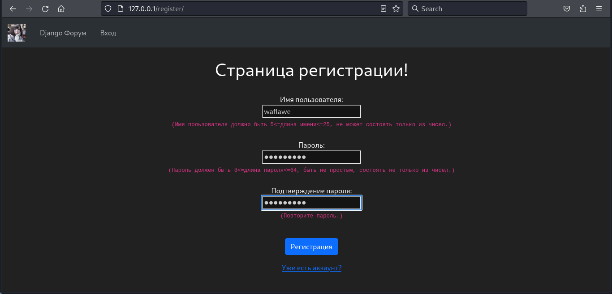
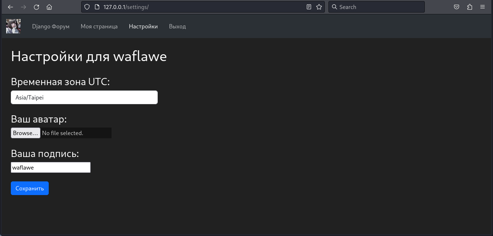
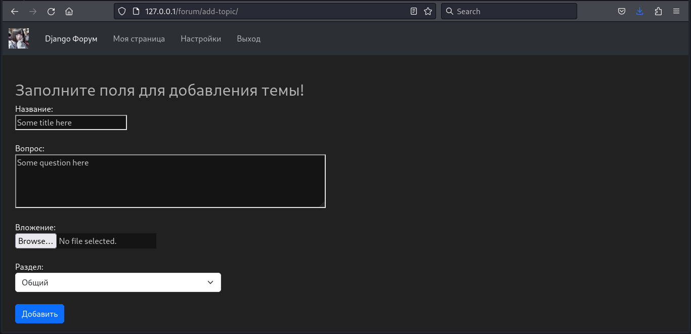
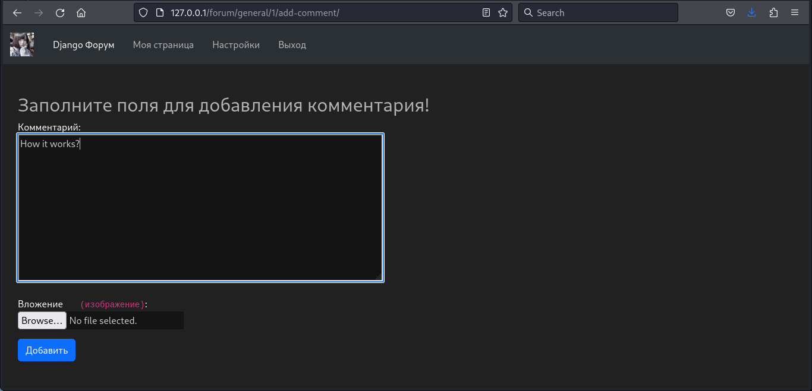
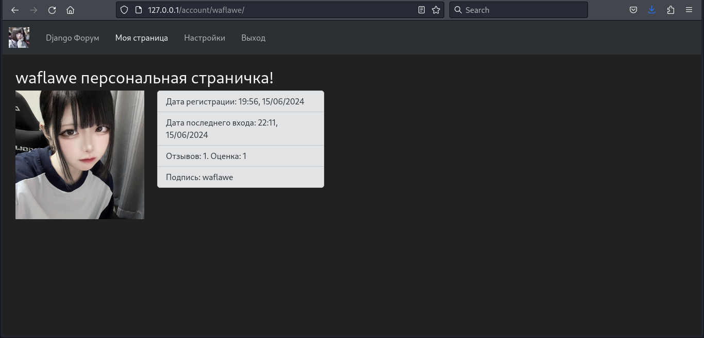
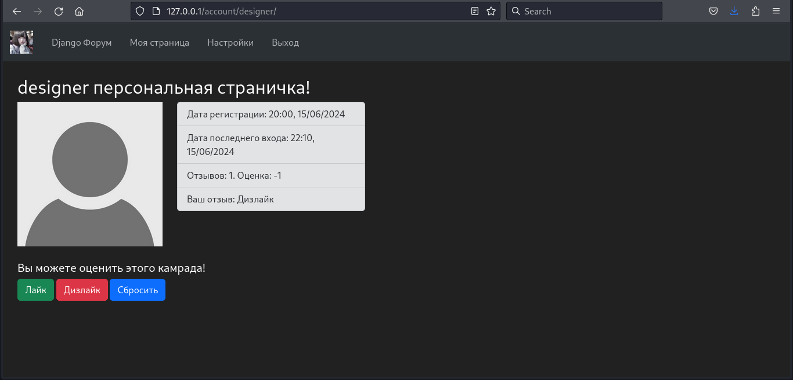

# Omenforcer
A simple forum dedicated to the Django framework, written in frameworks
__[Django](https://github.com/django/django)__,
__[Django REST Framework](https://github.com/encode/django-rest-framework)__. The project uses a relational DBMS
__[PostgreSQL](https://github.com/postgres/postgres)__ as the main database,
library __[celery](https://github.com/celery/celery)__ for working with deferred tasks,
non-relational DBMS __[Redis](https://github.com/redis/redis)__ as a message broker and for caching.
The __[djoser](https://github.com/sunscrapers/djoser)__ library is also used for account operations
via REST API, which also has a Swagger schema generated using
__[drf-spectacular](https://github.com/tfranzel/drf-spectacular/)__. Program
__[Docker](https://github.com/docker/compose)__'ized.
The linter and code formatter used is __[ruff](https://github.com/astral-sh/ruff)__.

__[Документация на русском](https://github.com/waflawe/Omenforcer/blob/main/README.md)__
<!-- TOC --><a name="table-of-contents"></a>
## Table of Contents
- [Omenforcer](#omenforcer)
   * [Table of Contents](#table-of-contents)
   * [Quick start](#quick-start)
      + [Installation](#installation)
      + [Running via Docker](#running-via-docker)
      + [Run locally](#run-locally)
   * [Description of functionality](#description-of-functionality)
   * [Screenshots](#screenshots)
   * [License](#license)
<!-- TOC --><a name="quick-start"></a>
## Quick start
<!-- TOC --><a name="installation"></a>
### Installation
```command line
git clone https://github.com/waflawe/Omenforcer.git
cd Omenforcer/
```

<!-- TOC --><a name="running-via-docker"></a>
### Running via Docker
1. Create a local `.env.docker` file following the example of the `.env.docker.template` file from the repository with environment variables
for docker.
2. Run Docker-compose:
```command line
docker-compose up
```
3. Go to [127.0.0.1:80](http://127.0.0.1:80).
4. Enjoy.

<!-- TOC --><a name="run-locally"></a>
### Run locally
1. Create a local `.env` file following the example of the `.env.template` file in the repository with environment variables for the project.
2. Open three independent terminals in the project folder. In the first we execute the following commands:
```command line
python -m venv venv
source venv/bin/activate
pip install -r requirements/dev.txt
redis-server
```
3. In the second the following:
```command line
source venv/bin/activate
celery -A forum.celery_setup:app worker --loglevel=info
```
4. In the third, these are:
```command line
source venv/bin/activate
python manage.py makemigrations
python manage.py migrate
python manage.py runserver 0.0.0.0:80
```
5. Go to [127.0.0.1:80](http://127.0.0.1:80).
6. Enjoy.
<!-- TOC --><a name="description-of-functionality"></a>
## Description of functionality
`Omenforcer` implements the following features:
  1. __Registration and Authorization__: Users can create and log in to accounts.
  2. __User Settings__: Users can change the time zone (affects all times on
website), your avatar, your signature on the forum.
  3. __Creating topics and comments on them__: any authorized user can create topics and comments on
forum, to which you can also attach an attachment in the form of a picture.
  4. __Rating of other users__: users can leave reviews about other forum users, raising or
lowering their overall rating.
  5. __Standard forum functionality__: sections, topics, global and sectional search, viewing other accounts
users, etc.
<!-- TOC --><a name="screenshots"></a>
## Screenshots
1. Registration:  
  
2. Authorization:  
 
3. Changing account settings:  
 
4. Adding a topic:  
 
5. Adding a comment:  
 
6. User page:  
 
7. Rating system up to:  
 
8. Rating system after:  
 
9. Global Search:  
 
<!-- TOC --><a name="license"></a>
## License
This project is licensed under the [MIT License](https://github.com/waflawe/Omenforcer/blob/main/LICENSE).
