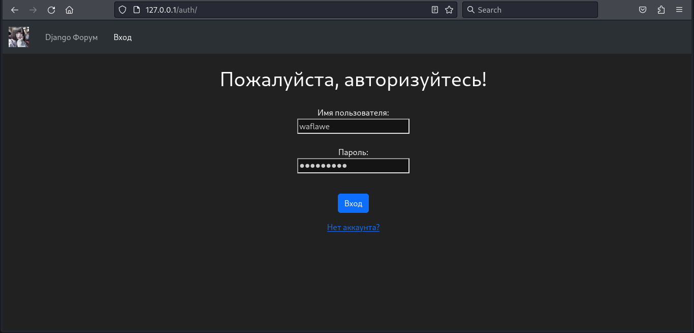
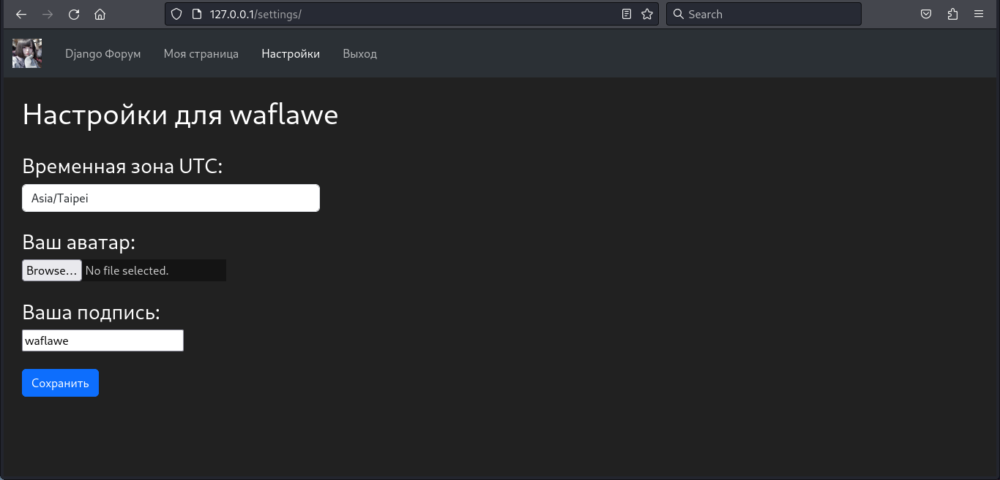
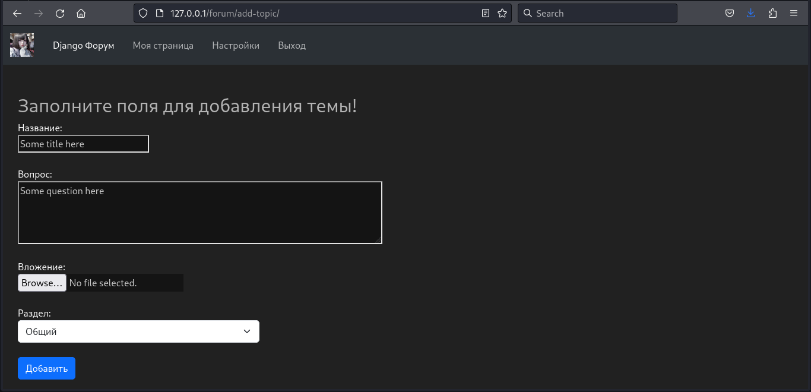
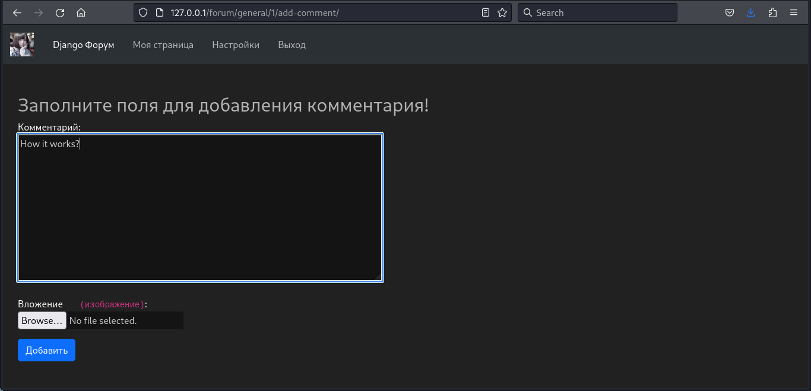
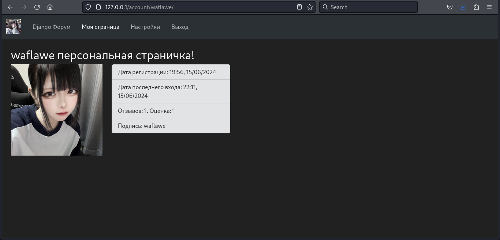
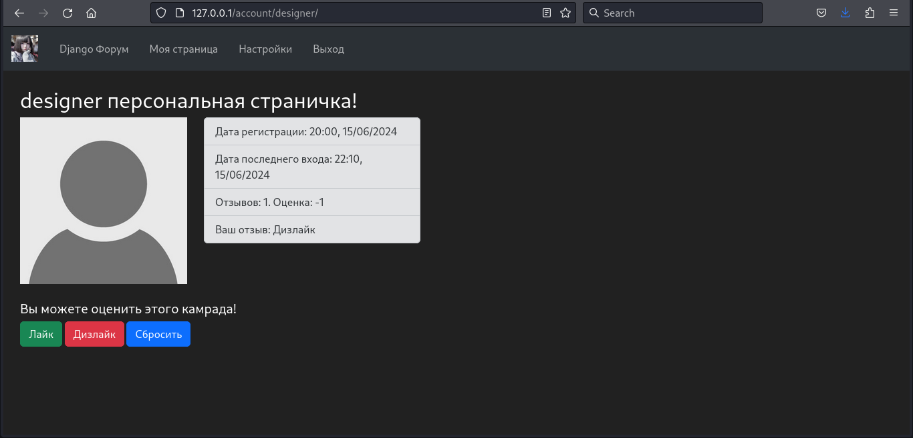
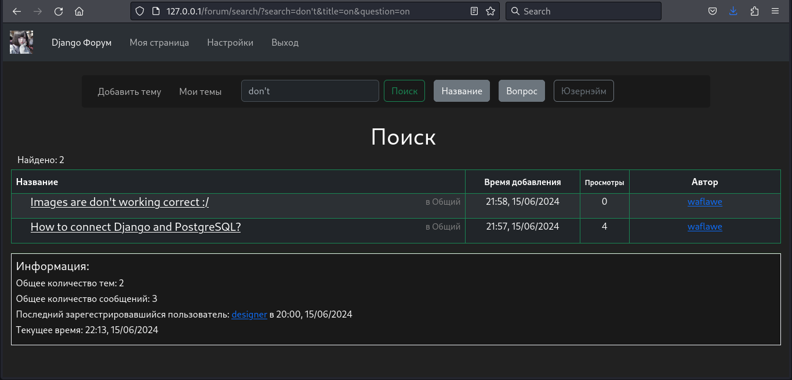

# Omenforcer  
Простой форум, посвященный фреймворку Django, написанный на фреймворках
__[Django](https://github.com/django/django)__,
__[Django REST Framework](https://github.com/encode/django-rest-framework)__. Проект использует реляционную СУБД
__[PostgreSQL](https://github.com/postgres/postgres)__ в качестве основной базы данных,
библиотеку __[celery](https://github.com/celery/celery)__ для работы с отложенными задачами,
нереляционную СУБД __[Redis](https://github.com/redis/redis)__ в качестве брокера сообщений и для кэширования.
Также применяется библиотека __[djoser](https://github.com/sunscrapers/djoser)__ для операций с аккаунтом
через REST API, к которому также имеется Swagger-схема, сгенерированная при помощи
__[drf-spectacular](https://github.com/tfranzel/drf-spectacular/)__. Программа 
__[Docker](https://github.com/docker/compose)__'изирована.
Используемый линтер и форматер кода - __[ruff](https://github.com/astral-sh/ruff)__.  
  
__[Documentation in English](https://github.com/waflawe/Omenforcer/blob/main/README-en.md)__
<!-- TOC --><a name="table-of-contents"></a>
## Карта контента
- [Omenforcer](#omenforcer)
   * [Карта контента](#table-of-contents)
   * [Быстрый старт](#quick-start)
      + [Установка](#installation)
      + [Запуск через Docker](#running-via-docker)
      + [Запуск локально](#run-locally)
   * [Описание функционала](#description-of-functionality)
   * [Скриншоты](#screenshots)
   * [Лицензия](#license)
<!-- TOC --><a name="quick-start"></a>
## Быстрый старт
<!-- TOC --><a name="installation"></a>
### Установка  
```commandline  
git clone https://github.com/waflawe/Omenforcer.git  
cd Omenforcer/
```  

<!-- TOC --><a name="running-via-docker"></a>
### Запуск через Docker  
1. Создаем локально файл `.env.docker` по примеру файла `.env.docker.template` из репозитория с переменными окружения 
для докера.
2. Поднимаем Docker-compose:
```commandline  
docker-compose up  
```
3. Переходим на [127.0.0.1:80](http://127.0.0.1:80).
4. Наслаждаемся.  

<!-- TOC --><a name="run-locally"></a>
### Запуск локально  
1. Создаем локально файл `.env` по примеру файла `.env.template` в репозитории с переменными окружения для проекта.  
2. Открываем три независимых терминала в папке проекта. В первом выполняем следующие команды:
```commandline  
python -m venv venv  
source venv/bin/activate  
pip install -r requirements/dev.txt  
redis-server  
```  
3. Во втором следующие:
```commandline  
source venv/bin/activate  
celery -A forum.celery_setup:app worker --loglevel=info  
```  
4. В тертьем вот такие:
```commandline  
source venv/bin/activate  
python manage.py makemigrations  
python manage.py migrate  
python manage.py runserver 0.0.0.0:80  
```  
5. Переходим на [127.0.0.1:80](http://127.0.0.1:80).
6. Наслаждаемся.  
<!-- TOC --><a name="description-of-functionality"></a>
## Описание функционала
`Omenforcer` реализует следующие возможности:  
	1. __Регистрация и Авторизация__: пользователи могут создавать аккаунты и входить в них.  
	2. __Настройки пользователя__: пользователи могут менять временную зону (влияет на все временные показатели на 
сайте), свой аватар, свою подпись на форуме.  
	3. __Создание тем и комментариев к ним__: любой авторизованный пользователь может создавать темы и комментарии на 
форуме, к которым так же можно прикрепить вложение в виде картинки.  
	4. __Рейтингование других пользователей__: пользователи могут оставлять отзывы о других форумчанинах, повышая или 
понижая их общий рейтинг.  
	5. __Стандартный функционал форума__: секции, темы, глобальный и секционный поиск, просмотр аккаунтов других 
пользователей и т.д.  
<!-- TOC --><a name="screenshots"></a>
## Скриншоты
1. Регистрация:  
	
2. Авторизация:  
   
3. Изменение настроек аккаунта:  
   
4. Добавление темы:  
   
5. Добавление комментария:  
   
6. Страница пользователя:  
   
7. Система рейтинга до:  
   
8. Система рейтинга после:  
   
9. Глобальный поиск:  
   
<!-- TOC --><a name="license"></a>
## Лицензия
Этот проект лицензирован [MIT лицензией](https://github.com/waflawe/Omenforcer/blob/main/LICENSE).
